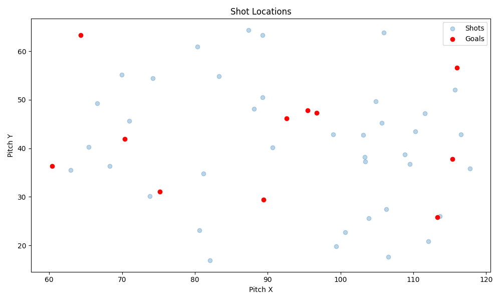
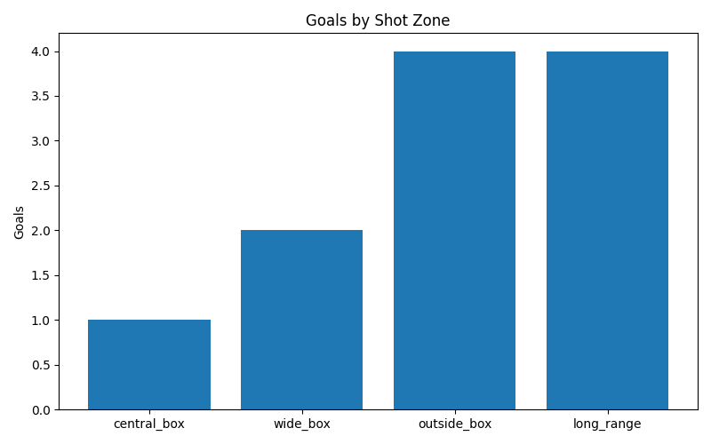

Champions League Shot Location and Distance Analysis

Project overview:
This project analyzes shot locations and distance tendencies in the UEFA Champions League using event level data from StatsBomb. 
The goal is to understand where players are taking shots from, how far those shots are, and how that relates to goal-scoring success.

Research question:
Where on the pitch are Champions League players/teams taking their shots from, 
and how does shot location relate to goal-scoring success?

Data Source
StatsBomb Open Data — publicly available event-level football data.
- Data format: JSON
- Event type used: Shot
- Coordinates: 120x80 pitch model
- Shot outcomes: Goal vs non-goal

StatsBomb Open Data is used exclusively for educational and analytical
purposes in accordance with their public usage terms.

How to run:
Ensure you have Python 3 installed on your system 
and the required libraries (matplotlib for visualization).

Testing:
Run the script with the "test" argument to execute unit tests and visualize sample shot data:

Test results:
test_distance_is_positive_for_regular_shot (__main__.TestShotDistance.test_distance_is_positive_for_regular_shot) ... ok
test_distance_known_value (__main__.TestShotDistance.test_distance_known_value) ... ok
test_distance_symmetry (__main__.TestShotDistance.test_distance_symmetry) ... ok
test_distance_zero_at_goal_center (__main__.TestShotDistance.test_distance_zero_at_goal_center) ... ok
test_zone_central_box (__main__.TestShotZoneClassification.test_zone_central_box) ... ok
test_zone_long_range (__main__.TestShotZoneClassification.test_zone_long_range) ... ok
test_zone_outside_box (__main__.TestShotZoneClassification.test_zone_outside_box) ... ok
test_zone_wide_box_lower (__main__.TestShotZoneClassification.test_zone_wide_box_lower) ... ok
test_zone_wide_box_upper (__main__.TestShotZoneClassification.test_zone_wide_box_upper) ... ok
test_boundary_values_are_valid (__main__.TestValidateShotCoordinates.test_boundary_values_are_valid) ... ok
test_raises_valueerror_for_both_out_of_bounds (__main__.TestValidateShotCoordinates.test_raises_valueerror_for_both_out_of_bounds) ... ok
test_raises_valueerror_for_negative_x (__main__.TestValidateShotCoordinates.test_raises_valueerror_for_negative_x) ... ok
test_raises_valueerror_for_negative_y (__main__.TestValidateShotCoordinates.test_raises_valueerror_for_negative_y) ... ok
test_raises_valueerror_for_x_too_large (__main__.TestValidateShotCoordinates.test_raises_valueerror_for_x_too_large) ... ok
test_raises_valueerror_for_y_too_large (__main__.TestValidateShotCoordinates.test_raises_valueerror_for_y_too_large) ... ok
test_valid_coordinates_do_not_raise (__main__.TestValidateShotCoordinates.test_valid_coordinates_do_not_raise) ... ok

----------------------------------------------------------------------
Ran 16 tests in 0.002s

OK

Vizualizations:
- Shot Map: A scatter plot of shot locations, with goals highlighted in red and misses in blue.
- Goals by Zone: A bar chart showing the number of goals scored from each shot zone (central box, wide box, outside box, long range).

Limitations:
- The analysis is limited to matches available in the StatsBomb Open Data set, which may not cover all Champions League matches or seasons.
- Fixed zones simplify complex shooting contexts and may not capture all nuances of shot quality or player decision-making.
- No predictive modeling or expected goals (xG) analysis is included, which could provide deeper insights into shot quality and player performance.

Author:
JJesus E. Ochoa Chavez
Python Course Final Poject - Testing and Debugging
